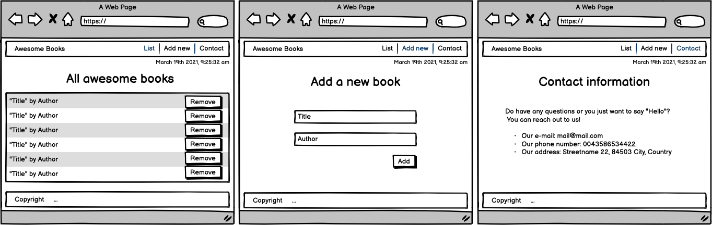

<a name="readme-top"></a>

<div align="center">
  <br/>

  <h3><b>README</b></h3>

</div>

# 📗 Table of Contents

- [📖 About the Project](#about-project)
  - [🛠 Built With](#built-with)
    - [Tech Stack](#tech-stack)
    - [Key Features](#key-features)
  - [🚀 Live Demo](#live-demo)
- [💻 Getting Started](#getting-started)
  - [Setup](#setup)
  - [Prerequisites](#prerequisites)
  - [Install](#install)
  - [Usage](#usage)
  - [Run tests](#run-tests)
  - [Deployment](#triangular_flag_on_post-deployment)
- [👥 Authors](#authors)
  - [👥 Contributors](#contributors)
- [🔭 Future Features](#future-features)
- [🤝 Contributing](#contributing)
- [⭐️ Show your support](#support)
- [🙏 Acknowledgements](#acknowledgements)
- [❓ FAQ (OPTIONAL)](#faq)
- [📝 License](#license)
- [⚠️Disclaimer](#disclaimer)

# 📖 [BookShelfProject] <a name="about-project"></a>


**[BookShelfProject]** is a mobile first webesite with two different pages to learn how to create and link multipage sites, including user interactions
and DOM manipulation with JavaScript. You can check [this](https://www.loom.com/share/076ca714e3294797b2f02c0d9d543174) video for a short walkthrough of the project.

## 🛠 Built With <a name="built-with"></a>

### Tech Stack <a name="tech-stack"></a>

<details>
  <summary>Server</summary>
  <ul>
    <li><a href="https://developer.mozilla.org/en/docs/Learn/HTML">HTML</a></li>
    <li><a href="https://developer.mozilla.org/en/docs/Web/CSS">CSS</a></li>
    <li><a href="https://developer.mozilla.org/en/docs/Web/JavaScript">JavaScript</a></li>
  </ul>
</details>

<details>
  <summary>UX/UI</summary>
  <ul>
    <li><a href="https://www.behance.net/gallery/29845175/CC-Global-Summit-2015">Inspired on a design by Cindy Shin</a></li>
  </ul>
</details>


### Key Features <a name="key-features"></a>

- **[Fully responsive design]**
- **[Mobile first]**
- **[Multipage site]**
- **[DOM manipulation]**
- **[Dynamic content]**

<p align="right">(<a href="#readme-top">back to top</a>)</p>

## 🚀 Live Demo <a name="live-demo"></a>

- [Live Demo](https://juniorgarciarodriguez.github.io/BookShelfProject/)

<p align="right">(<a href="#readme-top">back to top</a>)</p>

## 💻 Getting Started <a name="getting-started"></a>


To get a local copy up and running cloning this repo `git clone https://github.com/JuniorGarciaRodriguez/BookShelfProject.git`.

### Prerequisites

There are no known prerequisites to run this project. If you encounter any issues trying to run it, please feel
free to [open a ticket](../../issues/) to let me know and i will work on it to the best of my abilities

### Setup

Clone this repository to your desired folder:

```sh
  cd my-folder
  git clone https://github.com/JuniorGarciaRodriguez/BookShelfProject.git
```

### Usage

To run the project, open it in your browser of choice:


### Deployment

You can deploy this project using [github pages](https://docs.github.com/en/pages/quickstart), or a web-hosting platform of your choice.


<p align="right">(<a href="#readme-top">back to top</a>)</p>


## 👥 Authors <a name="authors"></a>

👤 **Junior Garcia**

- GitHub: [@J.Garcia](https://github.com/JuniorGarciaRodriguez)
- Twitter: [@J.Garcia](https://twitter.com/JGarciaGez)
- LinkedIn: [@J.Garcia](https://www.linkedin.com/in/junior-g-078143191/)

## 👥 Contributors <a name="contributors"></a>

👤 **Sebastian Hernández**

- GitHub: [@shm04](https://github.com/shm04)

<p align="right">(<a href="#readme-top">back to top</a>)</p>

## 🔭 Future Features <a name="future-features"></a>

- [ ] **[Single page application]**
- [ ] **[Complete website with navigation]**
- [ ] **[For a better view check our target design below]**


<p align="right">(<a href="#readme-top">back to top</a>)</p>

## 🤝 Contributing <a name="contributing"></a>

Contributions, issues, and feature requests are welcome! Your ideas may trigger the next features of the project once my knowledge base can reach the level of your imagination

Feel free to check the [issues page](../../issues/).

<p align="right">(<a href="#readme-top">back to top</a>)</p>

## ⭐️ Show your support <a name="support"></a>

If you like this project feel free to use it as you please within the scope of _[the license](./LICENSE)_ Credit will be appreciated but not mandatory.

<p align="right">(<a href="#readme-top">back to top</a>)</p>


## 🙏 Acknowledgments <a name="acknowledgements"></a>

I would like to thanks:
- **_[name](url)_** for mentoring me

<p align="right">(<a href="#readme-top">back to top</a>)</p>

## ❓ FAQ (OPTIONAL) <a name="faq"></a>

- **[No questions have been asked]**. Be the first curious mind

<p align="right">(<a href="#readme-top">back to top</a>)</p>

<!-- LICENSE -->

## 📝 License <a name="license"></a>

This project is [MIT](./LICENSE) licensed.

<p align="right">(<a href="#readme-top">back to top</a>)</p>

## ⚠️Disclaimer <a name="disclaimer"></a>

I only created the website html, styles and interactions _(html, css, js)_
The media files on this site __DOES NOT__ belong to me. All credit must be given to the original author/source. See details below

- [favicon](https://www.pixiv.net/en/artworks/71008974) by [横gon](https://www.pixiv.net/en/users/29647895)

<p align="right">(<a href="#readme-top">back to top</a>)</p>
